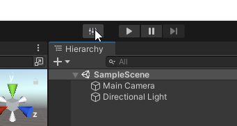
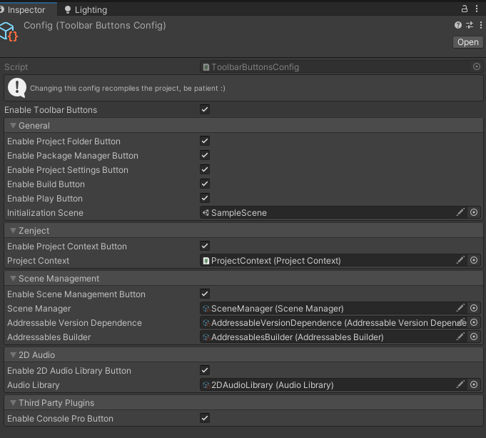
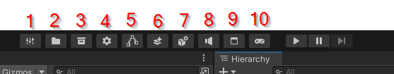

# DefaultToolbarButtons

This is our default configuration for our toolbar buttons.

This package works over [BennyKok's package](https://github.com/BennyKok/unity-toolbar-buttons), checkout their work.

## Setup

If you have access to the Whatever Dev's package registry, you can download this package from the package manager, if
not, figure it out yourself.

> If you don't see the package on the package manager, add the following line to your manifest.json.
> ````json
> "whateverdevs.default-toolbar-buttons": "0.0.1",
> ````

This package has lots of other packages as dependencies but you don't necessarily need to use them, it just needs them
to compile.

## Configuration

Once you have it installed, you will see a new button next to your play button, click it to access the configuration.





The config asset has toggles to enable all the buttons or individual buttons. Some of the buttons open assets in the
project, so you may be asked to reference them.

## Buttons overview



1. Opens the toolbar buttons settings.
2. Opens the project folder.
3. Opens the package manager.
4. Opens a menu to select between project settings and editor preferences.
5. Opens Extenject's Project Context.
6. Opens the build menu.
7. Opens a menu to select between the Scene Manager, the Addressable groups, Version Dependence asset or the Builder.
   This uses [WhateverDev's Scene Management](https://github.com/WhateverDevs/SceneManagement) and Unity Addressables
   packages.
   
8. Opens the 2D Audio Library. This uses [WhateverDev's 2D Audio system](https://github.com/WhateverDevs/2DAudio).
9. Opens [Console Pro](https://assetstore.unity.com/packages/tools/utilities/editor-console-pro-11889).
10. Opens the initial scene of the application and then plays it.
